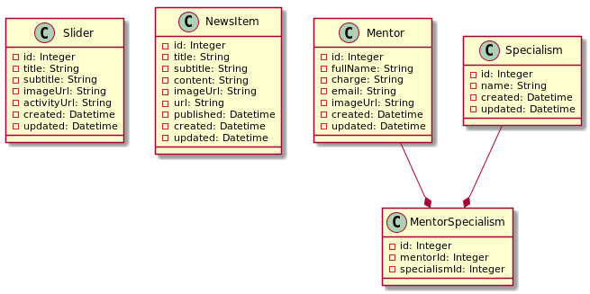

# Perl Mojo WebSockets + MongoDB

Gestor de Dependencias

    $ curl -L https://cpanmin.us | perl - App::cpanminus

Librería MongoDB - Perl

    $ sudo apt-get install libmongodb-perl libdatetime-perl

Archivo .env

    MONGO_HOST=localhost
    MONGO_PORT=27017
    MONGO_DB=tickets
    MONGO_USER=root
    MONGO_PASS=123
    APP_SECRET=mi_secreto_seguro_123456
    DEBUG=1

Dependencias

    $ cpanm Mojolicious MongoDB Mojo::JWT  Test::More Try::Tiny JSON DateTime

Arranacar la aplicación

    $ morbo app.pl

Print en consola:

    $c->app->log->debug(STR);

Dump de variables:

    use Mojo::JSON qw(encode_json);

    $c->app->log->debug("Config data: " . encode_json($config));

### Imágenes de PlantUML

Generar UMLs:

    $ chmod +x scripts/render_puml.sh
    $ scripts/render_puml.sh

---

## Documentación

Diagrama de clases

